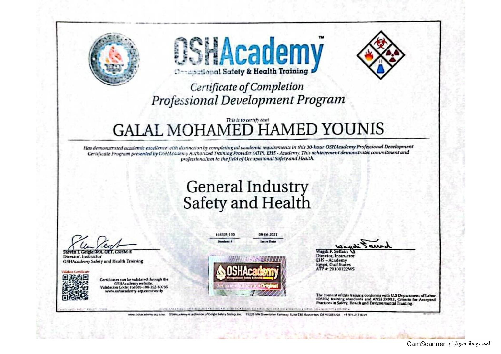

# 30-Hour General Industry Safety and Health

## Certificate Holder

**Galal Mohamed Hamed Younis**

## Training Provider

**OSHA Academy / EHS Academy**

## Training Program

**30-Hour General Industry Safety and Health**

## Certificate Type

Professional Development Program

## Issue Date

**August 6, 2021**

## Description

This certificate confirms that Galal Mohamed Hamed Younis successfully
completed the academic requirements of the 30-hour OSHA Academy
Professional Development Program in General Industry Safety and Health.

The program was presented by an OSHA Academy Authorized Training Provider
(EHS Academy).

## Certificate

