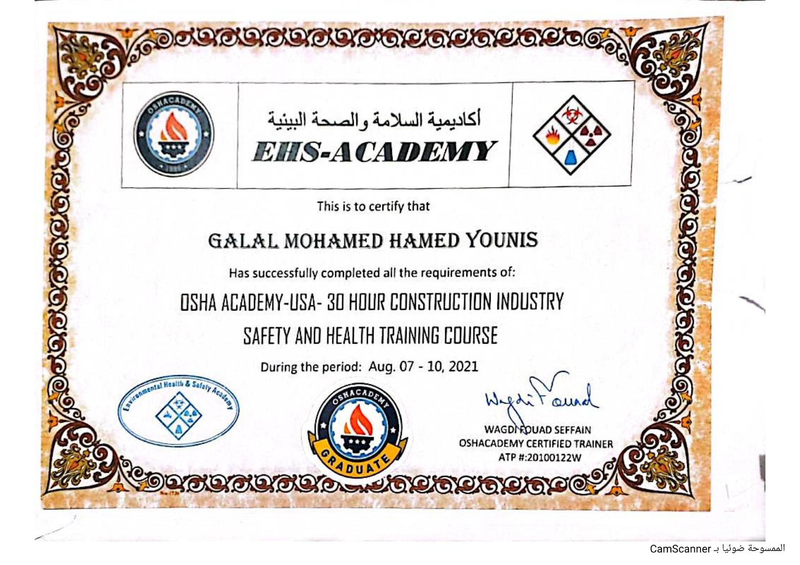

# 30-Hour Construction Industry Safety and Health

## Certificate Holder

**Galal Mohamed Hamed Younis**

## Training Provider

**OSHA Academy / EHS Academy**

## Training Program

**30-Hour Construction Industry Safety and Health Training Course**

## Certificate Type

Professional Development Program Certificate

## Training Period

**August 7–10, 2021**

## Description

This certificate confirms that Galal Mohamed Hamed Younis successfully
completed all the requirements of the OSHA Academy-USA 30-Hour Construction
Industry Safety and Health Training Course.

The training was provided through EHS Academy.

## Certificate

