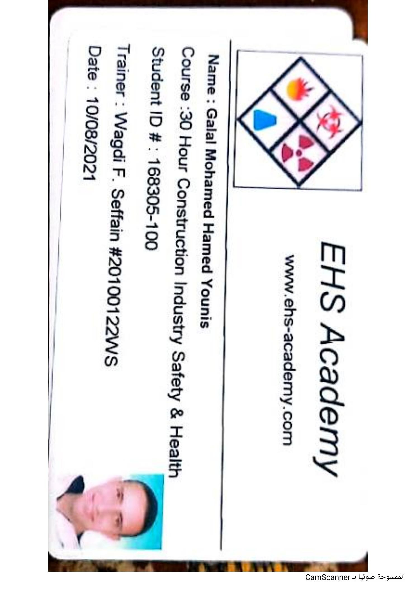

# 30-Hour Construction Industry Safety & Health Training Record

## Certificate Holder

**Galal Mohamed Hamed Younis**

## Training Provider

**EHS Academy**

## Training Program

**30-Hour Construction Industry Safety & Health**

## Student ID

**168305-100**

## Trainer

**Wagdi F. Seffain**

## Training Date

**August 10, 2021**

## Document Type

Student Training Record

## Description

This document is an official student training record issued by EHS Academy
for the 30-Hour Construction Industry Safety & Health training program.

It records the trainee's name, student ID, trainer, and training date.

## Training Record

