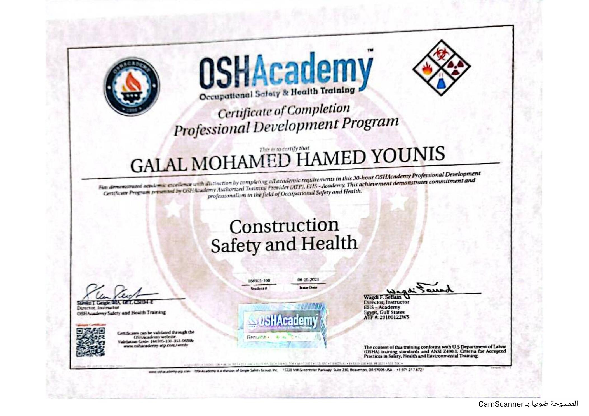

# Construction Safety and Health

## Certificate Holder

**Galal Mohamed Hamed Younis**

## Training Provider

**OSHA Academy / EHS Academy**

## Training Program

**Construction Safety and Health**

## Certificate Type

Certificate of Completion – Professional Development Program

## Issue Date

**October 6, 2021**

## Description

This certificate confirms that Galal Mohamed Hamed Younis successfully
completed the academic requirements of the OSHA Academy Professional
Development Program in Construction Safety and Health.

The training was provided through an OSHA Academy Authorized Training
Provider (EHS Academy).

## Certificate

