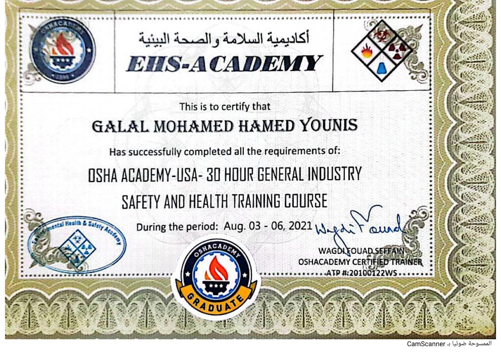

# 30-Hour General Industry Safety and Health

## Certificate Holder

**Galal Mohamed Hamed Younis**

## Training Provider

**OSHA Academy / EHS Academy**

## Training Program

**30-Hour General Industry Safety and Health**

## Certificate Type

Certificate of Completion – Professional Development Program

## Issue Date

**August 6, 2021**

## Description

This certificate confirms that Galal Mohamed Hamed Younis successfully
completed the requirements of the OSHA Academy-USA 30-Hour General Industry
Safety and Health Training Course.

The certificate was issued through EHS Academy.

## Certificate

