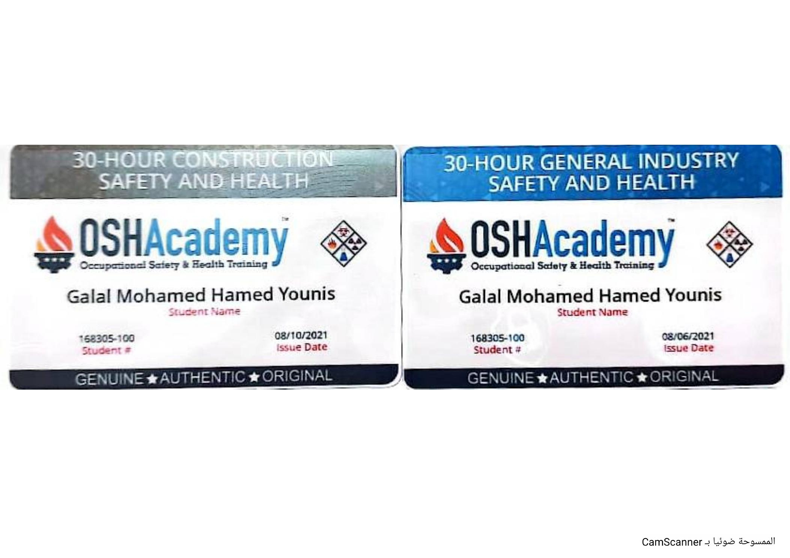

# OSHA Training Cards

## Certificate Holder

**Galal Mohamed Hamed Younis**

## Training Provider

**OSHA Academy**

## Documents

This document contains two OSHA Academy training cards:

- **30-Hour Construction Safety and Health**
- **30-Hour General Industry Safety and Health**

## Student Number

**168305-100**

## Issue Dates

- Construction Safety and Health: **August 10, 2021**
- General Industry Safety and Health: **August 6, 2021**

## Description

These training cards provide supporting documentation for the OSHA Academy
safety and health training programs completed by the certificate holder.

## Training Cards

