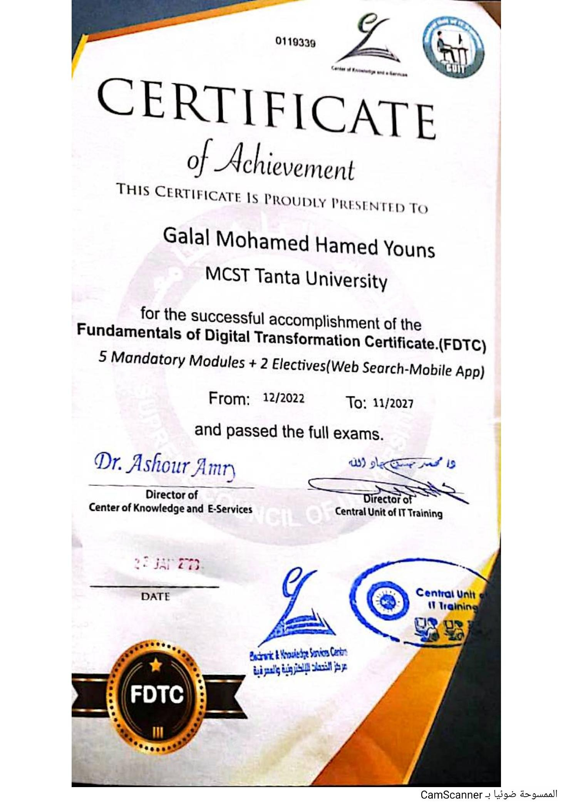

# Fundamentals of Digital Transformation Certificate

## Certificate Holder

**Galal Mohamed Hamed Youns**

## Institution

**MCST Tanta University**

## Certificate Program

**Fundamentals of Digital Transformation Certificate (FDTC)**

## Program Structure

- 5 Mandatory Modules
- 2 Electives
- Web Search
- Mobile App

## Completion

Successfully completed the required modules and passed the full exams.

## Program Period

**From:** December 2022  
**To:** November 2027

## Issuing Organizations

- Center of Knowledge and E-Services
- Central Unit of IT Training

## Certificate

