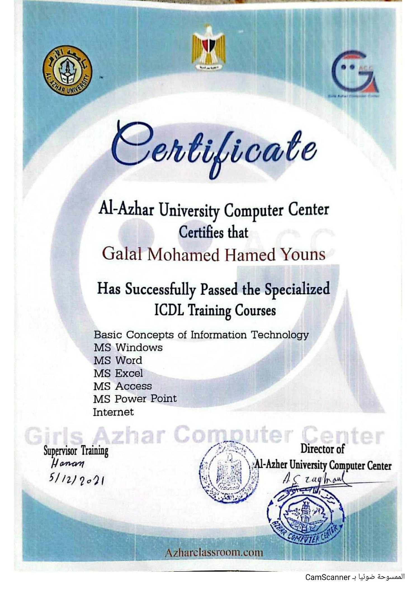

# ICDL Training Courses

## Certificate Holder

**Galal Mohamed Hamed Youns**

## Training Provider

**Al-Azhar University Computer Center**

## Training Program

**Specialized ICDL Training Courses**

## Completed Courses

- Basic Concepts of Information Technology
- MS Windows
- MS Word
- MS Excel
- MS Access
- MS PowerPoint
- Internet

## Completion

Successfully passed the Specialized ICDL Training Courses.

## Training Date

**May 12, 2021**

## Certificate

